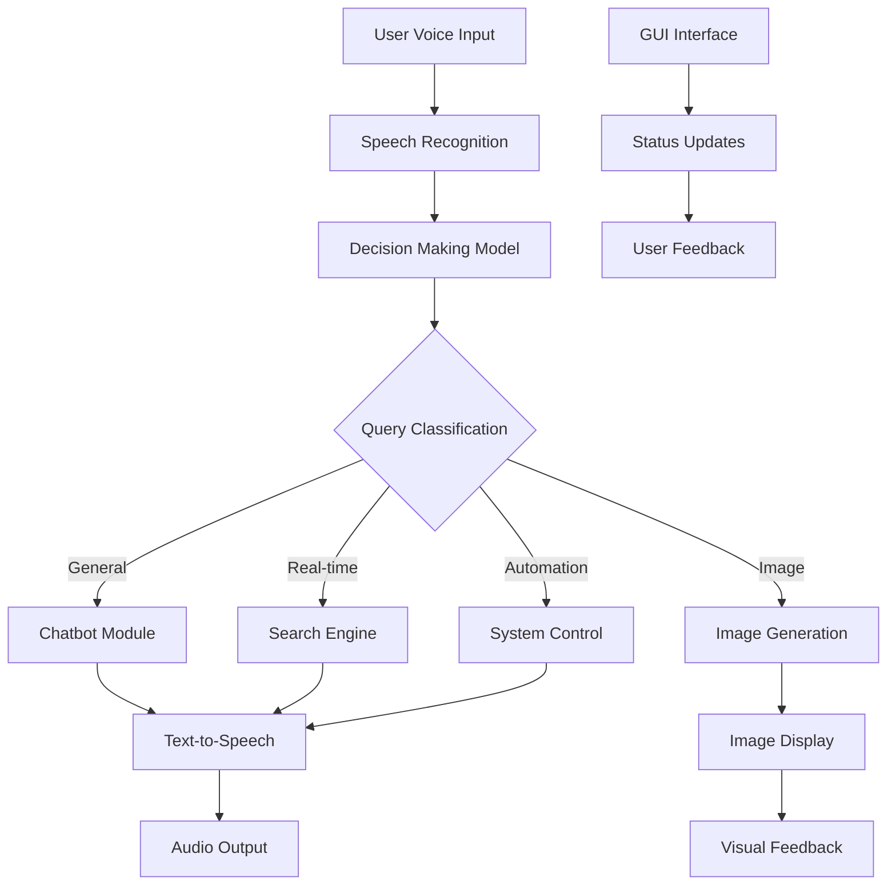

# 🤖 JARVIS AI Assistant

<div align="center">


**An advanced AI-powered voice assistant with real-time capabilities, image generation, and system automation**

[Features](#-features) • [Installation](#-installation) • [Configuration](#-configuration) • [Usage](#-usage) • [Architecture](#-architecture)

</div>

---

## 🌟 Overview

JARVIS (Just A Rather Very Intelligent System) is a comprehensive AI assistant that combines multiple cutting-edge technologies to provide a seamless voice-controlled experience. Built with Python and featuring a modern PyQt5 interface, JARVIS can understand speech, generate responses, create images, search the web, and control your system - all through natural conversation.

## ✨ Features

### 🎤 **Voice Interaction**
- **Real-time Speech Recognition** - Continuous voice input processing
- **Natural Text-to-Speech** - High-quality neural voice synthesis
- **Multi-language Support** - Configurable language settings
- **Wake Word Detection** - Microphone toggle for activation

### 🧠 **AI Capabilities**
- **Intelligent Query Classification** - Smart routing of user requests
- **Conversational AI** - Advanced chat with context awareness
- **Real-time Web Search** - Live information retrieval and summarization
- **Image Generation** - AI-powered visual content creation

### 🎮 **System Integration**
- **Application Control** - Open/close desktop applications
- **Media Management** - YouTube playback, music control
- **System Automation** - Volume, brightness, screen controls
- **Content Creation** - AI-generated documents and files

### 🎨 **Modern Interface**
- **Iron Man-inspired Design** - Sleek dark theme with neon accents
- **Real-time Visualizations** - Animated graphics and audio waves
- **Responsive GUI** - Smooth animations and transitions
- **Status Indicators** - Clear system state communication

## 🚀 Installation

### Prerequisites
- **Python 3.8+** (Recommended: Python 3.9+)
- **Windows 10/11** (Primary support)
- **Chrome Browser** (for speech recognition)
- **Microphone & Speakers** (for voice interaction)

### Quick Start

1. **Clone the Repository**
   ```bash
   git clone https://github.com/your-username/JARVIS.git
   cd JARVIS
   ```

2. **Run Setup**
   ```bash
   python setup.py
   ```

3. **Configure API Keys**
   ```bash
   # Edit config.py with your API keys
   notepad config.py
   ```

4. **Launch JARVIS**
   ```bash
   python app.py
   ```

## ⚙️ Configuration

### API Keys Setup

JARVIS requires API keys from three services:

| Service | Purpose | Get Key |
|---------|---------|---------|
| **Cohere** | Query classification & decision making | [cohere.ai](https://cohere.ai/) |
| **Groq** | Chat responses & real-time search | [groq.com](https://groq.com/) |
| **Hugging Face** | AI image generation | [huggingface.co](https://huggingface.co/) |

### Configuration File (`config.py`)

```python
# API Keys
CohereAPIKey = "your_cohere_api_key_here"
GroqAPIKey = "your_groq_api_key_here"
HuggingFaceAPIKey = "your_huggingface_api_key_here"

# User Settings
Username = "YourName"
Assistantname = "JARVIS"
InputLanguage = "en"
AssistantVoice = "en-CA-LiamNeural"
SpeechRate = "+70%"
```

## 🎯 Usage

### Voice Commands

| Command Type | Example | Action |
|--------------|---------|--------|
| **General Chat** | "Hello JARVIS, how are you?" | Conversational AI response |
| **Web Search** | "What's the weather today?" | Real-time information retrieval |
| **Image Generation** | "Generate an image of a sunset" | AI-powered image creation |
| **App Control** | "Open YouTube" | Application management |
| **System Control** | "Increase volume" | System automation |
| **Content Creation** | "Write a resignation letter" | AI document generation |

### GUI Controls

- **Microphone Button** - Toggle voice input on/off
- **Status Display** - Real-time system status
- **Chat History** - Conversation log with typing animation
- **Visualization Panel** - Animated graphics and audio waves

## 🏗️ Architecture

### System Design



### Core Modules

#### **Backend Components**

| Module | Technology | Purpose |
|--------|------------|---------|
| `Model.py` | Cohere API | Intelligent query classification |
| `Chatbot.py` | Groq API | Conversational AI responses |
| `SpeechToText.py` | Selenium + Chrome | Voice recognition |
| `TextToSpeech.py` | Edge TTS | Voice synthesis |
| `RealtimeSearchEngine.py` | Google Search + Groq | Web information retrieval |
| `ImageGeneration.py` | Hugging Face API | AI image creation |
| `Automation.py` | System APIs | Application and system control |

#### **Frontend Components**

| Component | Technology | Purpose |
|-----------|------------|---------|
| `Main.py` | PyQt5 | Main application controller |
| `GUI.py` | PyQt5 | Advanced visualization interface |
| `Graphics/` | PyQt5 + Custom | UI assets and animations |

### Data Flow

1. **Input Processing** - Voice → Speech Recognition → Text
2. **Query Analysis** - Text → Decision Model → Classification
3. **Response Generation** - Classification → Appropriate Module → Response
4. **Output Delivery** - Response → TTS/Audio/Visual → User

## 📁 Project Structure

```
JARVIS/
├── app.py                    # 🚀 Main entry point
├── config.py                 # ⚙️ Configuration & API keys
├── setup.py                  # 🔧 Setup script
├── requirements.txt          # 📦 Dependencies
├── README.md                 # 📖 Documentation
├── .gitignore               # 🔒 Security & cleanup
│
├── Backend/                  # 🧠 AI Core
│   ├── __init__.py
│   ├── Model.py             # Decision making
│   ├── Chatbot.py           # Conversational AI
│   ├── SpeechToText.py      # Voice recognition
│   ├── TextToSpeech.py      # Voice synthesis
│   ├── RealtimeSearchEngine.py # Web search
│   ├── ImageGeneration.py   # AI image creation
│   ├── Automation.py        # System control
│   ├── setup_chrome.py      # Browser setup
│   └── Data/                # Generated content
│       ├── *.jpg            # Generated images
│       ├── *.txt            # Generated documents
│       └── ChatLog.json     # Conversation history
│
├── Frontend/                 # 🎨 User Interface
│   ├── __init__.py
│   ├── Main.py              # Application controller
│   ├── Files/               # Runtime data
│   │   ├── *.data           # Status files
│   │   └── Speech.mp3       # Audio cache
│   └── Graphics/            # UI Assets
│       ├── GUI.py           # Main interface
│       ├── GUI2.py          # Alternative interface
│       ├── Jarvis.gif       # Animation
│       └── *.png            # UI icons
│
└── Data/                     # 💾 Persistent Data
    ├── ChatLog.json         # Main chat history
    └── Voice.html           # Speech recognition
```

## 🛠️ Troubleshooting

### Common Issues

| Issue | Solution |
|-------|----------|
| **Import Errors** | Run `python setup.py` to install dependencies |
| **API Errors** | Verify API keys in `config.py` |
| **Speech Recognition** | Ensure Chrome is installed and microphone access is granted |
| **GUI Issues** | Check PyQt5 installation: `pip install PyQt5` |
| **Audio Problems** | Verify speakers/microphone are working |

### Debug Mode

Run with verbose output:
```bash
python app.py --debug
```

## 🔒 Security

- **API Keys** - Never commit real keys to version control
- **Environment** - Use environment variables for production
- **Privacy** - All data processing is local except API calls
- **Access** - Microphone access required for voice features

## 🚀 Performance

- **Response Time** - < 2 seconds for most queries
- **Memory Usage** - ~200MB base + API response cache
- **CPU Usage** - Low during idle, moderate during processing
- **Storage** - ~50MB base + generated content

## 🔮 Future Enhancements

- [ ] **Multi-language Support** - Extended language options
- [ ] **Plugin System** - Custom command extensions
- [ ] **Mobile App** - Companion mobile interface
- [ ] **Cloud Sync** - Cross-device synchronization
- [ ] **Advanced Analytics** - Usage insights and optimization

## 📊 Technical Specifications

| Component | Specification |
|-----------|---------------|
| **Python Version** | 3.8+ |
| **GUI Framework** | PyQt5 |
| **AI Models** | Cohere Command-R+, Groq Llama3-70B, Stable Diffusion XL |
| **Speech Engine** | Chrome Web Speech API |
| **TTS Engine** | Microsoft Edge TTS |
| **Architecture** | Multi-threaded, Event-driven |

---

<div align="center">

**Developed by**  
**codexcherry © 2025**

*Building the future of AI interaction*

</div>
